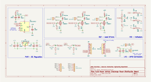

# FPVC Power Distribution Board

A 2-layer power distribution board designed in KiCad for the NFPA Fluid Powered Vehicle Challenge. Handles input fusing, load switching via MOSFETs, and regulated 5V/12V/24V outputs.

---

## Board Images

### Top and bottom layers

| Top layer | Bottom layer |
|---|---|
|  |  |

### Schematic

---

## Ordering from JLCPCB

### 1. Download the Gerber files

Download the latest Gerber files from the [Releases](../../releases) page as a `.zip` file. Do not unzip it — JLCPCB accepts the zip directly.

### 2. Upload to JLCPCB

1. Go to [jlcpcb.com](https://jlcpcb.com) and click **Order Now**
2. Click **Add Gerber File** and upload the `.zip`
3. JLCPCB will render a preview of the board — verify it looks correct before continuing

### 3. Configure the order options

Once uploaded, a list of fabrication options will appear. Set them as follows:

| Option | Value | Notes |
|---|---|---|
| **Base Material** | FR-4 | Standard PCB material |
| **Layers** | 2 | |
| **Dimensions** | Auto-detected | Verify against preview |
| **PCB Qty** | 5 (minimum) | Adjust as needed |
| **PCB Thickness** | 1.6mm | Standard |
| **PCB Color** | Your choice | Green is cheapest/fastest |
| **Silkscreen** | White | |
| **Surface Finish** | HASL (with lead) | Lead-free HASL also fine |
| **⚠️ Outer Copper Weight** | **2oz** | **Critical — must change from default** |
| **Via Covering** | Tented | |
| **Board Outline Tolerance** | ±0.2mm | Standard |
| **Confirm Production File** | No | |
| **Remove Order Number** | No | Yes adds ~$1.50 |

> **Why 2oz copper?** This board carries significant DC load currents through its power traces. 2oz copper (70µm) doubles the trace cross-sectional area compared to the default 1oz, reducing resistance and heat buildup. **Do not order with 1oz copper.**

### 4. Shipping & checkout

1. Click **Save to Cart**
2. Select your shipping method — **DHL Express** or **FedEx** typically arrive in 5–7 days to the US. Economy options are cheaper but can take 3–5 weeks
3. Complete checkout and pay

JLCPCB will send an email when the order moves to production and again when it ships.

---

## Bill of Materials

See [`fpvc-power-distribution-BOM.xlsx`](./documentation/fpvc-power-distribution-BOM.xlsx) for the full BOM. There is a mix of through-hole and surface-mount components. The 0805 package is hand-solderable or can be reflowed.

DigiKey links are provided in the BOM for all components that cannot be found in the Bucknell Maker-E Makerstock.

---

## License

Copyright 2026 Aiden Cherniske

Licensed under the Apache License, Version 2.0. See [`LICENSE`](./LICENSE) for the full text.